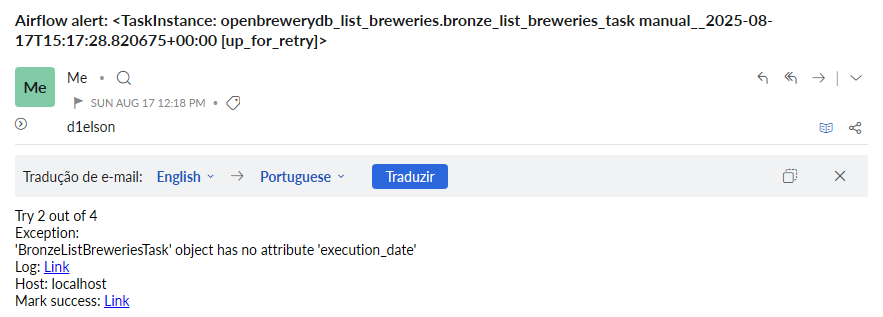
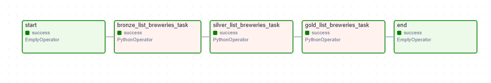

# Airflow Brewery

This repository contains the study case **BEES Data Engineering - Breweries Case**.

The project was tested on `Windows 11` with Python `3.9`.

---

## Project Structure

**Item**                | **Description**
|------------------------|-----------------------------------------------------------
| config/                | Spark and Google Cloud Storage configuration files (protected).
| dags/                  | Directory containing Airflow DAGs (data processing workflows).
| plugins/               | Plugins and helper libraries for Airflow.
| .env-sample            | Example environment variables file (the production `.env` is protected).
| airflow.cfg            | Airflow configuration file for local execution.
| docker-compose-swarm   | File to run the production container with Swarm.
| docker-compose.yml     | File to run Airflow containers locally.
| Dockerfile             | Docker image definition for Airflow containers.
| requirements.txt       | Required Python libraries for running the project.
| webserver_config.py    | Configuration file for the Airflow Webserver.

---

## Study Case Specifications

**Objective**
Consume data from an API, transform it, and persist it into a data lake following the **medallion architecture** with three layers:

- **Bronze**: raw data
- **Silver**: curated data partitioned by location
- **Gold**: analytical aggregated data

**Endpoint Used**: [https://api.openbrewerydb.org/v1/breweries](https://api.openbrewerydb.org/v1/breweries)

**Orchestration**:
Airflow is used for orchestration, with email alerts in case of failures. Unit tests have been added and will be extended further.

**Language**:
The project is written in Python, using **PySpark** for data processing.
To run Spark, please contact the project owner to obtain the required configurations.
Once obtained, place the file `spark_config.json` under `config/spark_config.json`.

**Containerization**:
Docker is used for containerization.
The image is based on Airflow 2.10 with all required dependencies.
A Swarm-compatible compose file is also provided for production deployment.

**Data Architecture**:
- Bronze: raw source data
- Silver: tabulated curated data
- Gold: business-level transformations

**Monitoring**:
Airflow Webserver is used to monitor DAG runs, task statuses, and errors.
Additionally, email alerts are triggered in case of failures.

**Repository**:
GitHub is used for version control.

**Cloud Services**:
This project integrates with cloud storage.
To read/write data in the cloud, request the configuration files from the project owner and place them as follows:
- `config/gcs_config.json`

**Notes**:
The `.env` file has been omitted for security reasons.
It is required for project execution — please request it from the project owner.

---

## DAG: `openbrewerydb_list_breweries`

This pipeline is responsible for **Extracting, Transforming, and Persisting** data from the Open Brewery DB API.
Its main purpose is to extract brewery information worldwide, catalog them by location, and generate brewery counts per location.

---

## DAG Structure

**Item**       | **Description**
|--------------|----------------------------------------------------------
| flow/        | Contains the main DAG file (`dag.py`).
| resources/   | Contains example images of the pipeline.
| tasks/       | Python scripts executed for ETL tasks.
| tests/       | Unit tests for the pipeline.
| tools/       | Supporting scripts and helper functions.

---

## Required Files (Not Included)

For full execution in production, the following files are required but were omitted for security reasons:

**Item**             | **Description**
|---------------------|------------------------------------------------
| gcs_config.json     | Cloud storage configuration file.
| spark_config.json   | PySpark configuration file.
| .env                | File containing email and Airflow credentials.

---

## Additional Notes

- Unit tests are located outside the main pipeline.
- Although the initial recommendation was to run unit tests before persisting data, this design was reconsidered as it is not a best practice.
